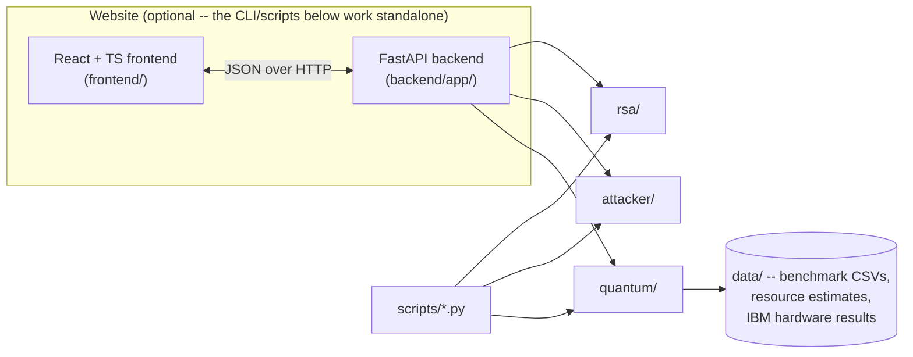

# Shor's Algorithm vs. RSA

[](https://github.com/iabhi92/shors-rsa-cracker/actions/workflows/ci.yml)
[](data/test_summary.json)
[](LICENSE)
[](requirements.txt)

A hands-on simulator and interactive website demonstrating why quantum computing breaks RSA:

1. RSA implemented from scratch in Python (`rsa/`) — no crypto libraries, so the weak points are visible.
2. A classical attacker (`attacker/`) that tries to factor the RSA modulus directly — fast for toy keys,
   exponentially hopeless for real ones.
3. A from-scratch quantum statevector simulator (`quantum/`) that runs the actual period-finding step of
   Shor's algorithm, plus the classical continued-fractions/gcd post-processing that turns a found period
   into RSA's secret factors. Two interchangeable backends for the one genuinely hard part (controlled
   modular exponentiation): a fast permutation shortcut, and an honest gate-level circuit built from
   elementary reversible-arithmetic gates with zero shortcuts — see `notes/04-gate-level-modular-exponentiation.md`.
4. `notes/` — crash-course writeups on the quantum computing concepts needed to understand the above,
   written while building this project.
5. `backend/` + `frontend/` — an interactive website: generate a real RSA key, encrypt a message, watch
   classical attacks fail, then run the actual quantum simulation to crack it — every page calls this
   project's real Python code, nothing is mocked. See `WEBSITE_IMPLEMENTATION_PLAN.md` for the architecture.

## Getting started

```bash
git clone https://github.com/iabhi92/shors-rsa-cracker.git
cd shors-rsa-cracker
python3 -m venv .venv && source .venv/bin/activate
pip install -r requirements.txt
python scripts/demo_crack.py   # generates a real RSA key, then breaks it with Shor's algorithm
```

That's the whole story end to end in one command: a real (small) RSA key gets generated,
encrypted, and then factored using nothing but the quantum simulator — no shortcuts, no
pre-computed answer. `pytest` runs the full test suite (319 tests). For the interactive
website instead of the CLI, jump to [Website](#website) below; for the full setup
(linting, type-checking, Docker), see [Setup](#setup).

## Architecture



See `AI_USAGE.md` for a running log of AI-assisted work on this project (per project requirements),
and `SECURITY.md` for the threat model and this project's known, by-design limitations as a
deliberately-insecure educational RSA implementation.

## Setup

```bash
python3 -m venv .venv
source .venv/bin/activate
pip install -r requirements.txt
pytest
```

For lint/type-checking too (what CI runs — see `.github/workflows/ci.yml`):

```bash
pip install -r requirements-dev.txt
ruff check .
mypy .
pre-commit install   # optional: run the same two checks automatically on every commit
```

## Try it

```bash
python scripts/demo_cli.py         # RSA keygen/encrypt/decrypt round trip
python scripts/benchmark_classical.py   # measured classical-attack scaling -> data/
python scripts/demo_crack.py       # the full story: encrypt, then break it with Shor's algorithm
python scripts/demo_crack_honest_circuit.py   # same story, but with zero quantum-circuit shortcuts
python scripts/resource_estimate.py       # qubit/gate counts at real RSA sizes -> data/
python scripts/run_on_ibm_hardware.py     # submits to a REAL IBM quantum computer (needs
                                           # requirements-hardware.txt + .env credentials,
                                           # see notes/05-real-hardware-validation.md)
```

## Website

```bash
# Backend (from repo root, same .venv as above)
pip install -r backend/requirements.txt
uvicorn backend.app.main:app --reload --port 8000

# Frontend (separate terminal)
cd frontend
npm install
npm run dev          # http://localhost:5173
```

Tests, linting, type-checking, and production build:

```bash
pytest backend/tests -v                 # 42 backend API tests
ruff check backend/ && mypy backend/    # same tooling as the rest of the project

cd frontend
npx tsc -b --noEmit   # TypeScript type-check
npm run lint            # oxlint
npm run build            # production build -> frontend/dist/
npx playwright test       # end-to-end tests (needs the backend running on :8000)
```

Docker (both services, one command, from repo root):

```bash
docker compose up --build   # frontend on :8080, backend on :8080/api (proxied)
```

Full details, safety limits, and what's deliberately *not* exposed (IBM credentials, private
keys beyond the response that generated them, arbitrary file paths) in `backend/README.md`,
`frontend/README.md`, and `WEBSITE_IMPLEMENTATION_PLAN.md`.

## Status

Core is built and tested (319 tests, `pytest`): RSA from scratch, a 4-method classical
attacker with a measured scaling benchmark, a from-scratch quantum statevector simulator
(gates, QFT verified against the exact DFT matrix), a full Shor's-algorithm pipeline that
handles every known real failure mode and breaks a real (toy-sized) RSA key end to end, a
fast/sampling simulator for N beyond the honest simulator's qubit budget, an independent
cross-check against Google's Cirq (statevectors match to floating-point precision), a
from-scratch gate-level modular exponentiation circuit (reversible Fourier adders → modular
multiplier → exponentiation, zero classical shortcuts in the arithmetic) that's
statevector-exact cross-validated against the permutation-based simulator and independently
breaks a real toy RSA key end to end, a closed-form resource estimate (qubits/gates at
real RSA sizes, cross-validated against actual measured gate counts at small scale) compared
against Gidney & Ekerå's published 2019 fault-tolerant estimate — both land on the same
polynomial (not exponential) scaling, independently — and a real run on actual IBM quantum
hardware (not just simulated): a compiled, provably-exact-for-this-case circuit, submitted to
a real 156-qubit IBM processor, run twice independently, whose noisy measurement distribution
landed a total variation distance of ~0.017 from this project's own theoretical prediction
both times (`notes/05-real-hardware-validation.md`).
Read `notes/` for the math, in
particular `notes/04-gate-level-modular-exponentiation.md` for the gate-level construction
and that resource estimate. All of the above is also reachable through the interactive
website (`backend/` + `frontend/`, see "Website" above): 14 pages, a FastAPI backend with 42
of its own tests calling this project's real code directly, and a Playwright end-to-end suite
that caught (and whose fix is documented in) a real stale-closure bug during development.

Since the initial website launch, the RSA/Shor's/Classical lab pages have gained a shared
step-by-step visualizer with real counterfactual toggles (e.g. "measure before vs. after the
inverse QFT," computed live rather than pre-recorded), the frontend now ships its own
Content-Security-Policy alongside the backend's (see `SECURITY.md`), and a stale precomputed
test-count figure was caught and fixed so the homepage always reflects a live `pytest` run.
The written report and presentation deck for this project's assessment are generated directly
from this repository's real, current data (test counts, benchmark CSVs, the IBM hardware JSON)
rather than from memory of earlier numbers.

See `AI_USAGE.md` and commit history for the full build log — it's a dated, session-by-session
record covering both what the AI assistant contributed and what was Abhinav's own direction,
decisions, and hands-on work throughout.
