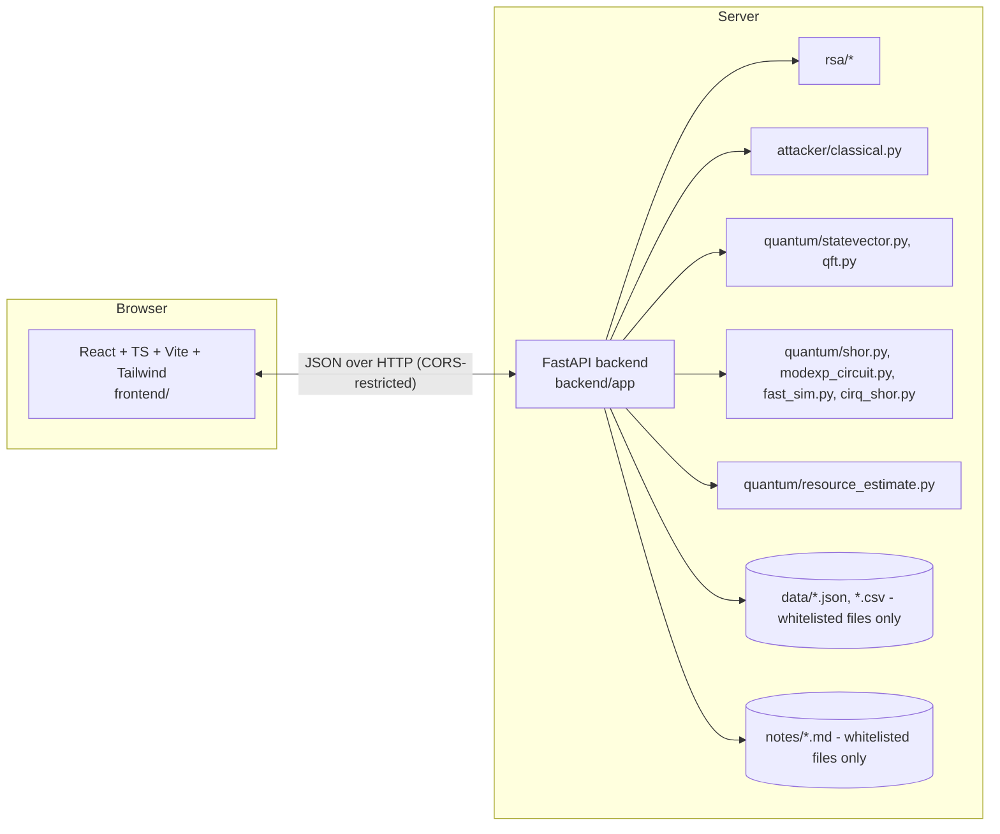

Website Implementation Plan

Baseline (recorded before any changes)

`pytest -q` on the existing repo: 257 passed, 0 failed (105s). This is the regression bar —
nothing below should reduce this number, and the existing `rsa/`, `attacker/`, `quantum/`
modules are consumed as-is by the backend, not rewritten. `data/query.json` and
`data/usage*.csv` were found in `data/` (an IBM Quantum usage-dashboard export containing the
project owner's real name/email/account ID/CRN) and added to `.gitignore` immediately, before
any backend code that reads from `data/` was written — the backend's data-loading code uses an
explicit filename whitelist, never a directory listing, specifically so files like these can
never be served even if they're still sitting in that folder.

Architecture

`backend/` imports the existing top-level packages (`rsa`, `attacker`, `quantum`) directly —
no duplication of cryptographic or quantum logic into the web layer. The one new backend-only
concept is *safe limits*: every endpoint that runs real computation (RSA keygen, classical
attacks, Shor's algorithm, statevector demos) caps its inputs to sizes that finish in a bounded
time, documented per-endpoint in `backend/app/limits.py`.

Pages -> API endpoints (what's real, what's stored)

| Page | Endpoint(s) | Data source |
|---|---|---|
| Home | `GET /api/meta` | computed from repo (pytest count via a cached, checked-in figure + live-computed method/backend lists) |
| RSA Laboratory | `POST /api/rsa/keygen`, `/api/rsa/encrypt`, `/api/rsa/decrypt` | live, `rsa/*` |
| Classical Attack Lab | `POST /api/classical/attack` | live, `attacker/classical.py`, capped timeout |
| Classical Benchmark | `GET /api/classical/benchmark` (+ guarded `POST regenerate`) | `data/classical_benchmark.csv` (loaded, not regenerated on view) |
| Quantum Fundamentals | `POST /api/quantum/gate-demo`, `/api/quantum/bell-state` | live, `quantum/statevector.py` |
| QFT & Period-Finding | `POST /api/quantum/qft-demo` | live, `quantum/qft.py`, incl. DFT-matrix validation |
| Shor's Algorithm Lab | `POST /api/shor/run` | live, `quantum/shor.py` (+ `modexp_circuit`, `fast_sim`, `cirq_shor` as selectable backends) |
| Circuit Explorer | `GET /api/circuit/metadata` | live, `quantum/resource_estimate.py`'s exact small-N counting register |
| Simulator Comparison | `GET /api/simulators/compare` | static table of documented facts (each row cites the source module/test) |
| Resource Estimation | `GET /api/resource-estimate?bits=` | live, `quantum/resource_estimate.py` (closed-form, real RSA sizes) |
| IBM Hardware Validation | `GET /api/ibm-hardware/results` | stored only — reads `data/ibm_hardware_run_a7_N15.json`; endpoint cannot submit a new job (no IBM credentials imported into `backend/` at all) |
| Security & Limitations | `GET /api/docs/security` | renders `SECURITY.md` |
| Development Journey | `GET /api/docs/journey` | derived from `AI_USAGE.md`, labelled as such |
| Documentation | `GET /api/docs/{slug}` | whitelisted `notes/*.md` files only |

Security controls

- No `eval`/`exec`/`subprocess`/shell execution anywhere in `backend/`.
- No file path ever comes from frontend input unvalidated — docs/notes endpoints use an
  explicit `slug -> Path` whitelist dict, not `Path(user_input)`.
- Every numeric input has a Pydantic-enforced range (e.g. RSA `bits` capped at 32, classical
  attack `n` capped and time-limited, Shor `N` restricted to a small allow-listed set matching
  the existing test suite's `SMALL_COMPOSITES`).
- IBM credentials (`IBM_QUANTUM_API_KEY`, `IBM_QUANTUM_CRN`) are never imported into
  `backend/` — the hardware page is physically incapable of triggering a new job because the
  code path to do so doesn't exist in this process.
- CORS origins read from an environment variable, not wildcarded.
- Errors caught and returned as clean JSON (`{"detail": "..."}"`), never a raw traceback.
- `.env.example` for the backend contains placeholder keys only.

Stages (as actually executed)

1. `WEBSITE_IMPLEMENTATION_PLAN.md` (this file) — written first, before any code.
2. `backend/`: FastAPI app, Pydantic schemas, limits, all endpoints listed above. While
   building this, direct interactive testing (not just unit tests) surfaced two real bugs,
   fixed before moving on: (a) the `/shor/backends` endpoint's response-model type annotation
   didn't match what it actually returned (FastAPI validates against return-type annotations
   implicitly); (b) the gate-level Shor backend took *minutes* for N=65 in a live timing test
   (its ancilla cost scales with `N.bit_length()`, not `n_count`, so the existing n_count cap
   alone didn't bound it) — fixed by restricting that backend to `SHOR_GATE_LEVEL_ALLOWED_N =
   (15,)`, the one case repeatedly measured fast throughout this project's own development.
3. 42 backend tests (`backend/tests/`, pytest + `TestClient`): one file per router, plus a
   dedicated `test_no_secret_leakage.py` sweeping every endpoint (success *and* error paths)
   for credential strings and raw tracebacks.
4. `frontend/`: Vite + React + TS + Tailwind + React Router scaffold, shared dark-theme layout
   with the required disclaimer banner, then all 14 content pages (Home, RSA Lab, Classical
   Attack Lab, Classical Benchmark, Quantum Fundamentals, QFT, Shor's Lab, Circuit Explorer,
   Simulator Comparison, Resource Estimation, IBM Hardware, Security, Documentation index +
   per-page, Development Journey) wired to the live backend.
5. Type-check (`tsc -b --noEmit`), lint (`oxlint`), production build (`vite build`) — all
   clean. Route-level code-splitting (`React.lazy`) added after the first build flagged a
   1.26MB main bundle; main chunk dropped to 246KB afterward.
6. Playwright installed and an 8-scenario end-to-end suite written and run against the *real*
   running app (not mocked) — covering every scenario the task specified. This is where the
   most important bug of the whole build was caught: `useAction`'s `run` callback was
   memoized with `useCallback(..., [])`, which pinned it to the *first* render's closure over
   the calling page's action function — so the RSA Lab's keygen button (and every other page
   using the same hook: classical attacks, Shor's Lab, Circuit Explorer, Resource Estimation)
   kept submitting whatever value its input field held on first render, silently ignoring
   later edits. An "invalid input produces a readable error" E2E test failed because the
   request being sent didn't actually contain the invalid value the test had just typed in —
   traced with a request-logging Playwright script, fixed with a ref-based pattern in
   `frontend/src/hooks/useApi.ts` (full explanation in that file's doc comment), verified
   fixed both via the E2E suite going green and via direct request-log confirmation on the
   other affected pages (Resource Estimation, Circuit Explorer).
7. Root/backend/frontend READMEs, Docker (`backend/Dockerfile`, `frontend/Dockerfile` +
   `nginx.conf`, root `docker-compose.yml`), `.dockerignore` (explicitly excluding
   `data/query.json` / `data/usage*.csv` — see below), mermaid architecture diagram in the
   root README.
8. Final secret-leak sweep and honest completion report (see the end-of-session summary for
   what's fully built vs. explicitly deferred).

An unrelated finding along the way

While inspecting `data/` before writing any code that reads from it, found
`data/query.json` and `data/usage*.csv` — an IBM Quantum usage-dashboard export (not created
by this work) containing the project owner's real name, email, IBM account ID, and CRN,
sitting in a directory that is *not* git-ignored. Added `.gitignore` entries for these
specific files immediately, before writing any backend code that touches `data/` (and that
code uses an explicit filename whitelist regardless, so it could never have served them).
Flagged to the user directly; not otherwise in scope for this task.

Status: everything above is built and shipped

This file was written before a single line of `backend/`/`frontend/` code existed and is kept
as the original plan, not rewritten after the fact — every stage in "Stages (as actually
executed)" above happened as described, including the bugs found along the way. Full detail
on the sessions since the initial launch is in `AI_USAGE.md`; the short version:

- Teaching visualizers (RSA Lab, Shor's Lab, Classical Attack Lab): the original 14 pages
  shipped with a working but fairly static explanation of each mechanism. A follow-up pass
  added a shared step-by-step visualizer component (numbered stage rail, KaTeX-rendered
  formula per stage, adjustable autoplay, a full-screen "Present" mode for projecting to a
  class), a real circuit diagram on the Shor's Lab page, and — the highest-value addition — a
  genuine "measure before QFT⁻¹ vs. after" counterfactual toggle computed live for whatever N
  and a are actually entered, not a canned example. Four real bugs were found and fixed while
  building this: a controlled-input field that silently reverted edits, a categorical color
  palette that failed a colorblind-safety check, a full-screen mode that double-mounted stale
  component state, and a deep-link feature that would have fired an API call on every
  keystroke if it had shipped as first written.
- Frontend security hardening: the backend API already had a tight Content-Security-Policy
  and a full set of security headers; the actual pages a person browses in the browser had no
  equivalent. Added a CSP to `frontend/index.html`, scoped to exactly the external origins the
  site genuinely loads from. Verified clean against the local dev server, then specifically
  against the real production build — which caught a regression the dev-only check had missed
  entirely (KaTeX's embedded base64 fonts being blocked outright), fixed and re-verified across
  every route.
- Stale data fix: the homepage's "tests passing" stat was reading a precomputed figure
  (257) that had gone stale relative to the actual, current test suite (319). Regenerated
  `data/test_summary.json` from a live `pytest --collect-only` run so the number shown matches
  the real repository state (see the file's own `note` field for how to regenerate it again).
- Report and presentation: the written report and slide deck (this project's COMP6841
  submission) were generated directly from the live repository data described above — test
  counts, the benchmark CSVs, the IBM hardware JSON, the resource-estimate figures — rather
  than from memory of what those numbers were earlier in the project, specifically so nothing
  in the submitted documents could drift out of sync with the actual code.

Current state: 319 tests passing, `ruff`/`mypy`/`tsc`/`oxlint`/production build all clean, no
known dependency CVEs (`pip-audit` and `npm audit` both clean as of the security hardening
pass above).
